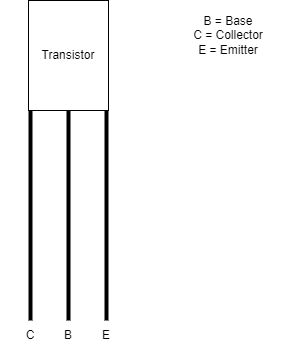
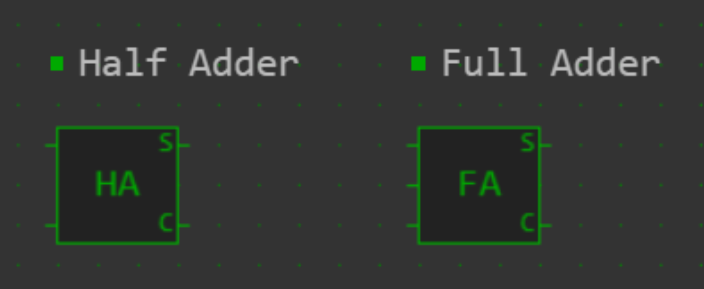

# Lets Make A CPU - by AmethystDev2713
### Copyright (c) 2023 AmethystDev2713. This eBook is licensed under the Creative Commons Attribution-NoDerivatives 4.0 International License (CC-BY-ND 4.0). See [the license text](https://creativecommons.org/licenses/by-nd/4.0/legalcode.txt) for terms and conditions.
Summary of terms: People are allowed and encouraged to read and learn from my eBook, use teachings to make their own, original works, and to share my eBook, unmodified, with other people while giving credit to me as the author.

Have questions/comments/concerns? Post them [here](https://github.com/AmethystDev2713/Lets-Make-A-CPU/discussions/1)

## Table of contents

| Section Name                                         | What we cover                                                                                                         |
|:----------------------------------------------------:|:---------------------------------------------------------------------------------------------------------------------:|
| Overview                                             | The basics of computers and CPUs                                                                                      |
| Section 1: Logic Gates                               | Transistors and Logic Gates: The building blocks of CPUs                                                              |
| Section 2: Areas of a CPU                            | What is the Control Unit, ALU, and Registers? What other parts are necessary to make a CPU work?                      |
| Section 3: Intro to Binary                           | What is binary and how does it work?                                                                                  |
| Section 4: Assembly & The Instruction Set            | What is the instruction set and what does it do?                                                                      |
| Section 5: Constructing Our CPU                      | What are the steps to build our CPU?                                                                                  |
| 5.1: Register Loading/Multi Step Instructions        | How do we make a register instruction processor? How do we avoid error when making multi-step instruction processors? |
| 5.2: 3-Step Instructions/Add + Subtract Instructions | How do we make a 3-step instruction processor? How do CPUs add + subtract binary numbers?                             |
| 5.3: Testing & Debugging                             | How do we check that our CPU is working? How to fix it if it isn't?                                                   |
| 5.4: Running Programs                                | Now that we have a working CPU, how can we make it do real work?                                                      |
| Section 6: Continuing Development                    | What are other types of CPU operations and architectures? What are other, more practical ways to develop a CPU?       |
| Conclusion                                           | What have we learned in this eBook?                                                                                   |

**Note:** What you are reading right now is an incomplete version. My ebook was paused for almost 3 years due to loss of interest, but as of 7/3/2026, writing will be resumed and finished due to having curious viewers (thanks for your time!)

**Edit status:** Occasional edits will occur, hoping to complete it by the end of this summer.

# Overview

If you're anything like me, you are curious about the computer's inner workings. One of the most powerful and important components is called the Centeral Processing Unit, or CPU. It's basically the brain of the computer. As StoryBots puts it, a computer/CPU's work is 3 simple steps: Input, Processing, Output.

**Input:** In this step, the CPU retrieves information from a source, such as RAM (Random Access Memory), ROM (Read Only Memory), Storage (USB drives/sticks/thumb drives, Hard disks, floppy disks, etc), direct user input from a device like a keyboard, etc. This process is like a student learning a new concept in school or remembering the answer to a question on a test. In computers, input is generally in one of the two forms: Instructions, which are the most important, or data, such as addresses to access different things in the computer, or simply numbers and letters. Let's go more in depth with these two forms of input

- Instructions
    - These are like your parents telling you to do your chores or your teacher telling you what your assignment is and how to do it. Instructions are words (in assembly, we'll talk about how that works later on) like CMP, which stands for Compare, which is used to compare two values, such as if they are equal, not equal, the first is greater than the second, or the first is less than the second.
- Data
    - This is simply information, like an essay. Let's say the CPU is doing a compare instruction, it needs data to compare, otherwise it does nothing or results in an error. Data can be in the form numbers, letters, addresses, etc. For example, if there is an instruction to put text on the screen, the CPU needs to know what to put on the screen, which is the data.

**Processing:** In this step, the CPU does the work it is told to do from input. There are a lot of things that can go on during processing, such as math operations, reading information from storage, etc. Like we discussed above with instructions, processing things like instructions is how the CPU will know what to do.

**Output:** There may not always be output to the user of the computer. Sometimes there is and sometimes there is not. For example, if a person who writes in the language of computers to create what are called programs, a set of instructions to tell the computer what to do without having to be rewritten every time, and is usually saved to storage, more commonly refered to as a programmer, decides to make a calculator program, and the user wants to know what is 35 * 7, the program will output the answer when it is done processing. An example of no output might be a two-step calculation, such as (35 * 7) - 26. In this kind of a calculation, you won't see the answer of 35 * 7 and the subtraction of 26, you will only see the final result, not both numbers. Think of how confused people would be if that was the case if someone made a quadratic formula solver! Numbers upon numbers we would see...

This eBook will teach you the basics of how a CPU works, and guide you to building your own CPU using logic gates to make input lines, instruction processors, and output lines. Instruction Processor Architecture (IPA) and instruction processors are **not** an industry standard for creating CPUs, they are an idea of the author of this eBook that is simple and will result in a functional CPU. If you want to learn more about how CPUs work, I would highly recommend checking out [this video by In One Lesson on Youtube](https://www.youtube.com/watch?v=cNN_tTXABUA) which goes into deep detail on how a CPU works without using technical language that the general public may not understand. Doing your own research is also a great way to learn more.

# Let's get started

# Section 1: Logic Gates

All CPUs at their heart are made up of one thing, the transistor

This is an NPN Transistor. All these marvels of engineering are is simple switches. As you can see above, the Transistor has 3 legs or wires comming out of it, a base, collector, and emitter.

**Base:** If a small amout of power/electricity is applied to this leg, the transistor turns on, and lets any current coming into the collector to flow out of the emitter

**Collector:** This is the transistor's input. If the base is on, but there is no electricity coming from the collector, there will be no output through the emitter

**Emitter:** This is the transistor's output. The only way to get output from a transistor is to have electricity flowing to the base, and the collector. Think of the base and collector as 2 people, and the emitter like a box which needs 2 people to lift it, signaling an output. If there is a single person, the box can’t be lifted. If both people are there, the box can be lifted, which translates to an output at the emitter of the transistor.

While this might seem simple and useless, I'm about to explain why this invention is such a breakthrough, aside from it being it to operate at near the speed of light and being so simple that it can be manufactures to be so small, you need a microscope to see it. Seriously, the millions and even billions of transistors that make up a CPU, are only a few ATOMS wide! Isn't that incredible?

Anyways, the reason why transistors are 98% of the whole CPU, is because their bases, collectors, and emitters can be arranged in certain ways to make what are called "Logic Gates". They perform what are called Boolean operations, whose only two possible inputs and outputs are on and off. This is also explained better in the video by In One Lesson. Here are a few examples: AND, OR, NOT

**AND Gate**

To find out what the 4 possible combinations of inputs from the switches do, we use truth tables, which tell whether a switch is on or off by using a 0 for off and 1 for on

| Switch A | Switch B | Output |
|:--------:|:--------:|:------:|
| 0        | 0        | 0      |
| 1        | 0        | 0      |
| 0        | 1        | 0      |
| 1        | 1        | 1      |

This shows that the AND Gate will not turn on unless both of the switches are one, hence, the name

**OR Gate**

In this case, both of the collectors are powered, so when either, or even both of the inputs are powered, there will be an output.

Truth table:
| Switch A | Switch B | Output |
|:--------:|:--------:|:------:|
| 0        | 0        | 0      |
| 1        | 0        | 1      |
| 0        | 1        | 1      |
| 1        | 1        | 1      |

**NOT Gate**

The NOT Gate, also known as an inverter, will invert the input. The way it works is really wierd, so prepare yourself. Here is the truth table (Note: There is only one input)

| Switch | Output |
|:------:|:------:|
| 0      | 1      |
| 1      | 0      |

When you input power to a transistor (usually from a battery of some sort or a DC Power supply), there are 2 outputs: Positive and Negative. The previous 2 gates (and the NPN Transistor) use positive power to do their work, but since the NOT gate works the opposite way, it uses negative power, and a different transistor, called the PNP Transistor. It's similar to the NPN, but its collecter is its output, and its emitter is its input (where you input negative power) instead of its input. The base is unchanged. Using this mechanism, we can apply negative power to the LED and the PNP Transistor to make them on by default instead of off. Then, when we input negative power to the base of the transistor by using the switch, which is also connected to negative power, the transistor will turn off, also turning the LED off.

Don't worry too much about how the transistors work right now since we will be using logic simulation programs to create our CPU.

These basic logic gates are used to form more complicated logic gates, such as the XOR (pronounces Ex-Or), NOR, and NAND. Here are their Truth tables

**XOR:** Exclusive OR, only 1 input can be on for there to be an output

| Switch A | Switch B | Output |
|:--------:|:--------:|:------:|
| 0        | 0        | 0      |
| 1        | 0        | 1      |
| 0        | 1        | 1      |
| 1        | 1        | 0      |

**NOR:** Inverted OR, either or both inputs being on will turn off the gate

| Switch A | Switch B | Output |
|:--------:|:--------:|:------:|
| 0        | 0        | 1      |
| 1        | 0        | 0      |
| 0        | 1        | 0      |
| 1        | 1        | 0      |

**NAND:** Inverted AND, Both inputs must be on for the gate to turn off

| Switch A | Switch B | Output |
|:--------:|:--------:|:------:|
| 0        | 0        | 1      |
| 1        | 0        | 1      |
| 0        | 1        | 1      |
| 1        | 1        | 0      |

These gates, made from transistors, are the building blocks of every CPU.

⚠️ To follow along with this eBook, you will need to use a logic simulator of some sort. Many of the images in this eBook use [simulator.io](https://simulator.io). However, use of this simulator is **no longer recommended** because it is no longer fully functional. Simulator.io was fully functional back when this eBook was started in 2023, but saved/private boards are no longer functional. As such, you should use another simulator like [Logigator](https://logigator.com/) which has an active community and is fully functional.

# Section 2: Areas of a CPU

With out new knowledge of transistors and logic gates, we can talk about the 3 basic areas of a CPU, the Control Unit, ALU, and Registers

**Control Unit:** This is the brain of the CPU, which tells the ALU and Registers to do. It's job is to process most instructions, control registers, and work with the ALU. The control unit can process all instructions except for arthematic and comparision instructions. Those two types of instructions are processed by the ALU.

**ALU (Arthematic Logic Unit):** This area of the CPU basically does math and inequality instructions

**Registers:** This are little storage spaces which store a byte or a few bytes of data that the CPU needs to access repetitivly and quickly

The video by In One Lesson also goes into depth on how each of these are used in a CPU. In short, the control unit is the brain of the CPU, the ALU does math operations, and the Registers are temporary, quick access storage places inside the CPU. Each of these areas are made with logic gates to carry out instructions that the creator wants it to.

# Section 3: Intro to Binary

To better understand binary, we will be using the very famous 6502 8-Bit microprocessor (pronounced six-five-oh-two or sixtey five-oh-two, I personally prefer the first pronounciation), made by MOS Technology, and used in famous computers of its era, such as the Apple II and Commodore 64, as our example CPU for this section.

Computers work by using a number system called Binary. It's a system where values/data/instructions are represented in 1s and 0s. Binary is the language of computers, and in the case of the 6502 CPU, being an 8-Bit CPU, it's binary system uses 8 places where there can be a 1 or 0, which are called bits. By today's standards, 8 bits is equal to 1 byte. Here is an example of an 8-Bit number: 01011110. For demonstration purposes, let's say that 01011110 is a number. How do we know what it is in decimal (the number system us humans use, which is 1, 2, 3, 4, 5, 6, 7, 8, 9, 10, etc) ? People have come up with a smart strategy to convert binary into decimal, but if you don't want to do the calculations manually, which is perfectly fine, you can use an online calculator. If you would like to do the calculations by hand, here is a guide:

1. An 8-Bit Binary can represent values from 0 to 255. For Example, 00000001 is one, 00000010 is 2, 00000011 is 3, and so on. Here's the key concept: 2-Bit Binary can represent numbers 0 - 3, so the first bit, which is the rightmost bit, represents 1, and the left most bit represents 2. With 3-Bit, you can see values 0-7, so from **Right to left**, each bit represents 1, 2, and 4. For each bit from right to left, the value it represents is double the last. Here's a diagram to convert a random binary number to decimal

| 0 | 0 | 0 | 0 | 0 | 0 | 0 | 0 |
|:-:|:-:|:-:|:-:|:-:|:-:|:-:|:-:|
|128| 64| 32| 16| 8 | 4 | 2 | 1 |

What this is showing is if the bit at a given place is 1, it takes the value underneath it. For example:

| 0 | 0 | 0 | 1 | 0 | 0 | 1 | 0 |
|:-:|:-:|:-:|:-:|:-:|:-:|:-:|:-:|
|128| 64| 32| 16| 8 | 4 | 2 | 1 |
|.  |.  |.  | 16|.  |.  | 2 |.  |
|.  |.  |add|---|---|---|---|---|
|.  |.  |.  |.  |.  |.  | 18|.  |

&nbsp;&nbsp;&nbsp;&nbsp;&nbsp;&nbsp;&nbsp;&nbsp;&nbsp;&nbsp;&nbsp;&nbsp;&nbsp;&nbsp;&nbsp;&nbsp;&nbsp;&nbsp;&nbsp;&nbsp;&nbsp;&nbsp;&nbsp;&nbsp;&nbsp;&nbsp;&nbsp;&nbsp;&nbsp;&nbsp;&nbsp;&nbsp;&nbsp;&nbsp;number in decimal ^^^^

2. The same principle applies to larger binary numbers, like 16-Bit Binary Numbers.

The bit at place 2 is set to 1, so one of out factors is 2. Same thing with place 16, so add 16 + 2, and the result of 00010010 converted to decimal is 18. Learning to convert binary to decimal can be helpful when developing your CPU since it's a crucial part of creating your instruction set

# Section 4: Assembly & The Instruction Set

Before you run away from the computer screaming upon hearing "assembly", we won't be using x86 or 64-Bit assembly to help learn about this topic or for examples, they're WAAY to complicated for our purposes. Instead, let's create our own varient for our CPU, which is very simple, like 6502 assembly. As we get better and better with CPU design and creation, only then can we scale up the complexity.

Just like numbers are represented in binary, you can "program" your CPU, so to speak, to accept certain combinations of binary bits as an instruction. Obviously, it's much harder to remember a binary number than an assembly instruction. Assembly is basically the CPU's language written in a form easily understantable by humans. The 6502 CPU's datasheet, and other CPU's datasheets (basically their manuel, **please** whatever you do, don't look up the Intel manuels. They will horrify and confuse you beyond the capacity of your brain), tell you what of its 50ish instructions are in hexadecimal, which is another numbering system, like binary, used in computing, where each bit has 16 possible combinations instead of 2, like with binary. But we won't get in depth with that since you're better off using binary when making a simple CPU. If you ever become smart enough and design your own 16-Bit, 32-Bit, or even 64-Bit CPU, which would be a SUPER impressive feat, you would rather write a hexadecimal number like 09D7 than a binary number like 0101010100111111, which is obviously very long. Anyways, here are the steps to designing your instruction set:

- Planning.
   - What is your CPU going to be like? Is it going to be super simple (like my [3-Bit CPU](https://simulator.io/board/C2geCb4c2j), if you can even call it a CPU) and only adds and subtracts numbers? Is it going to be designed for use in mechanical contraptions, like a loom machine? Maybe for robots? Perhaps for a computer, which is the most common use for a CPU. Depending on the use, you can conclude what kind of instructions it should have
   - What will its binary range be? Will it be 4-Bit (I would recommend this as your minimum if you are making a CPU to actually do something useful) like the world's first CPU, the Intel 4004? 8-Bit, like the 6502 or Z80? 16-bit, like the 65816 or Motorola 68000 series? The more funtionality you want, the higher your binary range should be.
- Drafting
   - Your CPU should, at minimum, have the following types of fundamental instructions:
      - Load instructions, which can write values to registers or read data from RAM or ROM and save it to a register
      - Compare instructions, which are basically inequality operations. These can be used in things as simple as a number guessing game to an OS (Operating System, such as Windows, Macintosh/Mac, Linux, etc) for your CPU
      - Input Instructions, which can take the user's input for something like a number guessing game
      - Output instructions, which can be as simple as turning on or off a set of LEDs or as complicated as outputting what's going on in a video game to the screen
   - Aside from those 4, you can decide whatever else you want your computer to do! It's going to be your design, after all
   - Create an instruction set table, such as this one:

| Instruction name | Binary form | Usage                                                                                      |
|:-----------------|:-----------:|:-------------------------------------------------------------------------------------------|
| LDA              | 0001        | Load a byte of data into register A                                                        |
| LDB              | 0010        | Load a byte of data into register B                                                        |
| LDC              | 0011        | Load a byte of data into register C                                                        |
| CMPE             | 0100        | Check if the next 2 binary numbers following are equal to each other                       |
| CMPN             | 0101        | Check if the next 2 binary numbers following are not equal to each other                   |
| CMPG             | 0100        | Check if the next binary number following is greater than the next binary number           |
| CMPL             | 0101        | Check if the next binary number following is less than the next binary number              |
| IN               | 0110        | Get Input from the input device, saves to register C                                       |
| OUT              | 0111        | Send output to an output device                                                            |
| ADD              | 1000        | Adds the next 2 binary numbers, saves to register C                                        |
| SUB              | 1001        | Subtracts the next 2 binary numbers, saves to register C                                   |
| JMP              | 1010        | Jump to a line in code file                                                                |
| JMPX             | 1011        | Jump to a line in code file if the previous comparision resulted in "true" as its result   |
| RGA              | 1100        | Keyword: Used to use the value of register A with other instructions                       |
| RGB              | 1101        | Keyword: Used to use the value of register B with other instructions                       |
| RGC              | 1110        | Keyword: Used to use the value of register C with other instructions                       |

The left most column is the instruction in assembly, which is a special class of programming language called machine language, or machine code, because these instructions carry out operations exactly like the CPU does and grant the user full access to the CPU. This is generally only used by experienced computer workers, but in our case, where we are making our own CPU and assembly code for it, we don't need a professional or highly experienced user to do the work, since it's your very own variation of assembly, designed for your CPU. The middle column shows the instruction in binary, which is how your CPU will read it, and the right most column, well, explains it. As simple as these seem, you can already make simple programs, and maybe even find uses nobody ever knew about when using mutiple different instructions together! Here's a code example for a number guessing game using the assembly table above:

1. `LDA 1001`
2. `IN`
3. `CMPE RGA RGC`
4. `JMPX 7`
5. `OUT Guess again`
6. `JMP 2`
7. `OUT Correct! Good Job!`

Here is the code explanation: Load the correct number into register A, which is 1001 in binary, or 9 in decimal. Get the user's guess with the IN instruction. Since it saves to register C, compare the correct answer (Register A) with the user's guess (Register C). If they are the same (meaning the user has guessed the correct number), skip the "guess again" message and jump to the "Correct! Good Job!" message to tell the user they guessed the correct number. If the 2 numbers are not equal, then the JMPX instruction will be ignored, since the user didn't guess the correct number, and will then show the "guess again" message and jump to the IN instruction to get the user's next guess. Of course, CPU's only understand 1s and 0s, so you will need to do a process called "interpreting" where you convert (or a program you made converts) the assembly code into 1s and 0s based off of your table. After you have 1s and 0s, your CPU will now be able to read your code! The only problem in this specific example is we are unable to interpret text into binary, since we have too few bits, as for with numbers, you can represent them as binary numbers 0000 - 1111, since this is a 4-Bit CPU example. In order for it to be actually interpreted, if you want, would be to replace "guess again" with 0 to indicate that the wrong number was guessed, and "Correct! Good Job!" with 1 to indicate that the correct number was guessed. Like I've mentioned before, if you want to make your CPU do more, you will have to increase your binary range to give more possible combinations of binary, representing more and more functions for the CPU to carry out.

# Section 5: Constructing Our CPU

This is when logic gates come in. You can arrange all types of logic gates to make them do different functions. If you examine my CPU, you will see an instruction processor for each of the 4 instructions. Based on the instruction set I designed, I am going to show you how to make instruction processors for each of the functions. So, here’s how the process works *(please keep in mind this approach is NOT how any CPU was ever made, it's just a random method I made up which I thought was at least somewhat easy to understand, and is being used and shown for educational purposes)*:

1. Create a part to check if a certain binary combination has been inputted. This can usually be done with an AND gate with as many inputs as the binary range is. For example, If you look at the first instruction processor on my example CPU, you can see some of the inputs are inverted to ensure that only a very specific combination of binary will allow the instruction to start processing. Another important part of this step is to create a locking mechanism, so that the CPU doesn't get confused on which bytes are for each instruction. Here's a diagram on Simulator.io:

In the examples above, you can see that only the specific binary combination to activate an instruction is inputted, only that instruction processor (the group of logic gates that do the instruction you want) will turn on, and it will lock the others to prevent them from accidentally turning on, until that instruction processor is done processing. For demonstration purposes, each "programmed" instruction with logic gates will turn on an LED to indicate that they are active and lock the other one. In a real CPU, in the place of the LEDs would be more logic gates to do whatever the designer wants the CPU to do.

2. Set up (a lot) of logic gates to do what I want the CPU to do, whether it's a register, ALU, output functions, etc.
3. Test the CPU. Just like programming in a language like C, you have to test your code for bugs. Similarly, you have to test your logic circuit (set of logic gates which work together as a unit to perform a task) to make sure it's working the way it should be.

You can think of the process as this: Plan (this is what section 4 was about), Build, and Test, just as if you were building a robot, RC Car/Airplane, making a Lego set from your imagination, etc.

You can have many, or few instruction processors, depending on how your instruction set works. You may only need a few if your instructions can process many different functions per single instruction processor, or you may need a lot if each instruction does only 1 function. In short, depending on whether each instruction can do 1 function or multiple, you may need only a few, big processors, or several, small ones. Hopefully this approach will make the learning process on how to make a CPU do the work you want it to easier to get a hold of rather than looking at transistor-scale drawings, like this monstrosity:

This image was found on visual6502.org

Or reading CPU manuals, which would be 100x worse than looking at those images.

## 5.1 Register Loading/Multi Step Instructions

### The Register

There are many types of circuits you can make to carry out different functions. Starting with the essentials, the first type of instruction we are going to make a processor for is register loading instructions. After showing you how registers work, we will discuss multi-step instructions, which are instructions that can do work using multiple inputs. You need to be able to create them because almost every instruction you can make for your CPU will need multiple inputs. Let’s get into it.

This is a register using D Latches, which hold their current state until both the data pin is set to the needed value and a clock pulse is triggered.

That was a simple demo. A proper register is made up of with 4-5 parts:

1. Some form of memory or latch to save a value
2. Value input lines
3. An Enable wire
4. A Set wire
5. Optionally, a reset wire

Here is a better demo of a register:

Here, the D Latches are the form of memory, the Bit switches + their wires are the value input lines the AND gates + the switch & wires going to their left side inputs are the Enable part, and the Set switch & its wires are the Set part. I did not make a reset part since there is a simpler way to reset the register: Save a 0 to it by setting the Bit switches off (representing a binary 0), and toggle the Set switch (turn it on and off. I could have used a button there, and then I'd just have to press it once to Set the register, but I have a habit of using switches).

### Multi Step Instruction Circuitry

Register loading is a multi-step instruction: activate the instruction processor, give a value to load & save it, move on. Currently, we only have a register. We need a logic circuit which will lock the other instruction processors until we are ready to move on. That circuit is called a counter. As the name implies, it will count up (or down, depending on the design) in binary to keep track of things like what instruction from memory needs to be processed now and next, and how many steps have been completed in a multi-step instruction. In this design that uses a D Latch and a Flip Flop, it will tick twice before giving an output, signaling the end of our two-step instruction.

This is a 2-step counter which will reset itself on the second pulse, so you don’t have to worry about creating circuitry to handle resetting it.
For a three-step instruction, you would make a circuit using 2 D-Latches and an AND gate.

In Logigator, you will need to use half adders, which are a circuit which can add 2, 1-Bit binary numbers, to make a counter. Take a look below to see how.

This is a 3 step counter, and requires a 4th pulse to reset the counter, just so you know.

If you ever make a high speed CPU, you might notice a problem of how fast the counter can switch between outputting different binary numbers, since there is a slight delay when switching between numbers, meaning it takes time for each bit to turn on and off, a counter could end up displaying a completely off-track binary number before displaying the correct one, so be careful when making counter. From my observations, this shouldn’t be an issue unless you are making a counter with more than 4 steps. Rest assured that it is possible to create a set of logic gates that will fix this time delay issue. These kinds of counters are called synchronous counters.

Since instructions like these take multiple inputs/steps, we need to make sure we aren't accidentally triggering other instruction processors while one instruction is still running. Like mentioned before, you can use lockers to do this, which will unlock once the instruction processor is done processing.

Now, we have 3 mechanisms, the counter, register, and the locker. Now the question is how can we combine them into one circuit?

## Our First Instruction Processor!

Let's Build it together! Make sure you leave plenty of room to the left and above this so that we can add other components later on!

To start, we need a way to simulate the instruction processor, and more that we add on, receiving input. We can do this using 4 input bit switches (this will result in a 4-Bit instruction processor. You can make it 8-Bit or more, but for simplicity's sake, we'll stick to 4 bits), AND gates + a button (or switch) to send the bits into the instruction processor, and long wires going down for instruction processors to branch off of. This is called a bus. What kind of bus? That depends on what will be transmitted on it. The most common types of busses are address and data busses. The one we are making right now is a data bus

The first part of the actual instruction processor is the instruction checker, which checks to see if the specific binary number to activate the instruction processor has been inputted. If the specific number is being inputted, and the instruction checker is not locked, it will give an output to signal the beginning of the instruction.

This part uses an AND gate, a delay gate (labeled with a 1 for a 1 tick delay), and NOT gates. Using a combination & specific arrangement of delay and NOT gates, you can make the AND gate turn on only when the binary number to activate the instruction processor has been inputted.

What you see in the image is an arrangement to detect the binary number 0001 for activating: The top input of the AND gate is connected to a delay gate, which shows that Bit 0, since it is connected to the data bus wire for Bit 0, must be 1. The rest of the inputs of the AND gate are connected to NOT gates, showing that Bits 1-3 must be 0. With the combination of 0001, this instruction processor will activate.

The instruction beginning signal needs to be stored. The instruction running flag will do that and will stay on until a number has been inputted to be saved to the register, and then will turn off, signaling the end of the instruction.

After that, we need to be able to tell what step of the instruction we are in. Register loading is a 2 step instruction: Start instruction, load value, end. Ending is not a step we need to account for in our instruction processor's step count as it will automatically happen when 2 steps have been complete. The flag and counter will be reset once the end is reached.

Then, we need to lock other instruction processors from activating while the active one is processing. These wires allow the instruction processor to lock the input wires and be locked. The one off to the left allows other instruction processors to lock it, and at the bottom is a locker preventing data from going to the second and rest of the instruction processors. **Important:** This mechanism only works for the first instruction processor. For all others, you will need to use a locker wire like the one I showed, which is to the left.

These logic gates are what actually control register loading. When the instruction running flag is on, it will unlock the loading wires and reset the register so a new value can be saved.

Hopefully with that explanation, the register loading mechanism makes more sense. Whether the instruction is 2-step or 4-step (like a register loading mechanism or a compare instruction, which might be like: Compare [operation] [value1] [value2]), an instruction processor follows these basic steps: Activation, processing, step counting, reset the instruction processor.

## 5.2: 3-Step Instructions/Add + Subtract Instructions

One of the functions of a CPU is to carry out arithmetic functions, mainly addition, subtraction, and comparisions. These functions are carried out by the CPU's ALU.

Most Logic Simulators come equipped with the Half Adder and Full Adder.

These are the building blocks of a binary adder. They have 2 or 3 inputs, a sum, and a carry. This [video by In One Lesson](https://youtu.be/VBDoT8o4q00?t=411) nicely teaches how half and full adders work.

To make a 4-Bit Adder, you use a half adder, and 3 full adders, with the carry-out wires going to the next adder's carry-in input. This is what a 4-Bit adder looks like:

What's happening here is the carry of each adder is going to the carry-in wire (usually the bottom wire, but I used the top one since the bits are unlabeled) of the next adder, and the lase carry-out wire is acting as an overflow flag, and will block the output of the answer if the answer is greater than the largest number you can make with 4-Bit Binary, which is 15, or 1111. We then have 2 inputs for 2, 4-Bit binary numbers, and here's where it might get strange, the first bit of the 1st number goes to the first input of the first adder, and the first number of the *2nd* number goes to the 2nd input of the first adder, and it keeps going in a pattern like that (If you're able to trace the wires to their connections)

Unfortunatly, in most logic simulators, half and full subtractors are not their own component, so we have to make our own. Thankfull, GeeksForGeeks has a design for a [Half Subtractor](https://www.geeksforgeeks.org/half-subtractor-in-digital-logic/) and a [Full Subtractor](https://www.geeksforgeeks.org/full-subtractor-in-digital-logic/) which you can then link up the same way you'd do with a half and full adder. Don't worry about logging in, it likes to annoy you with that popup, but nevertheless it's a good resource for learning about technology

Here's what a 4-Bit Subtractor looks like:

Similar to overflow, the subtractor has a flag to indicate that the answer will be negative, and if that's the case, there will be no output, mainly because for whatever reason, 0000 - 0001, which should be negative one, produces an output of 1111, which we don't directly see because of the negative number flag.

Let's set up a 3-register system, and adder, and a subtractor (which is basically what my 3-Bit CPU is, only with 2 register). This is where it's going to get really tricky, so proceed with caution.

First, let's set up 3 registers with the mechanism we made before. Make sure to change which inputs of the first AND gate are inverted, so that all of them don't activate at once. Let's also move all the registers, NOT the instruction processors, just the RS latches, next to each other for organization and quick access purposes, and add a locker to the output of each register so we can use only the 2 we want to.

Keep in mind that only the first instruction processor can use the AND gates to lock the data wires, all the other ones will use an OR gate with several inputs from different instruction processors whose output is connected to the locker of that specific instruction processor, which comes after the AND gate to see if the specific binary input is being used. Here's what I mean:

At the bottom, let's add an instruction processor which will tell our ALU to add or subtract 2 numbers. It will need to be able to send 3 outputs to the ALU: The operation (1000 for add and 1001 for subtract), then the first number, and lastly the second number.

To make our ALU, we sort of have to make a CPU, inside of the one we have right now. If you want, you can have the circuitry next to all the work you’ve done so far, or inside an IC (integrated circuit) chip. However, ICs are only available on Logigator and some other similar programs, but not simulator.io. An IC chip is an electronic circuit manufactured at microscopic scales which are then packaged in a small, black box with metal pins sticking out on its long sides which allow it to communicate with whatever is on the main board. Basically, it’s a pretty small electronic circuit. Just like how our CPU has an input for receiving instructions, an IC chip has pins which are its means of I/O. One pin might be for power, another from data, another for communicating with a graphics chip, etc. When designing large-scale circuits like these, they can reduce the clutter on your circuit. This is what real IC chips would look like:

[https://semiengineering.com/what-is-an-integrated-circuit/](https://semiengineering.com/what-is-an-integrated-circuit/)

And in Logigator, they look like this:

To make an IC, press Alt + N, or click the new component button

You will then see a screen which looks like this:

Fill out Name and Symbol, and make sure you flip the Share Publicly switch so it’s red, like shown above. Then click Create. You should now see a screen like this:

There will be a tab with the name of your IC chip (for me, it’s just IC Chip). Scroll down in the side bar until you see Input and Output plugs:

These are like the buttons you see on the register, giving input, and LEDs giving output, like on the adder & subtractor. When you go back to the main screen, you will see little wires coming out on the left, which are your input plugs, and wires coming out on the right, which are your output plugs. If you want to give your CPU a cleaner overall look, you could put your registers inside IC chips, like so:

